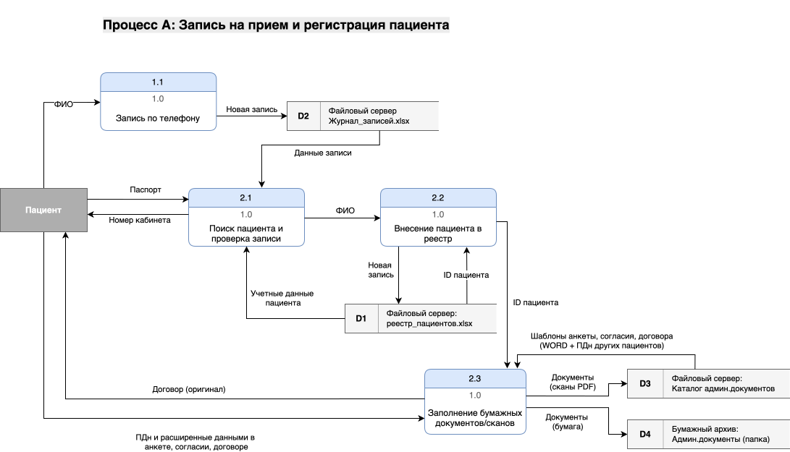
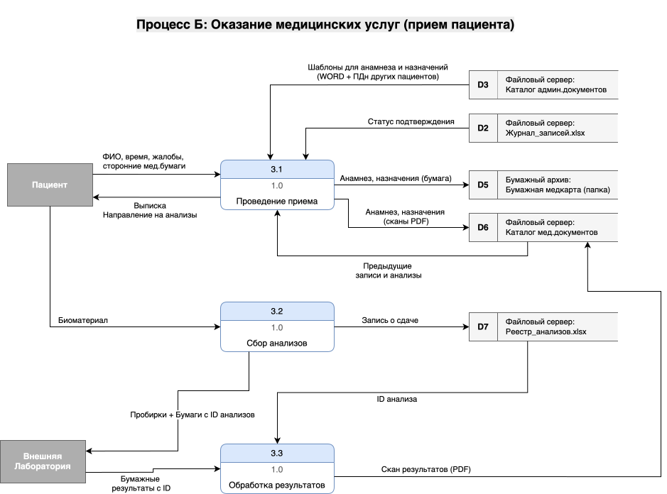
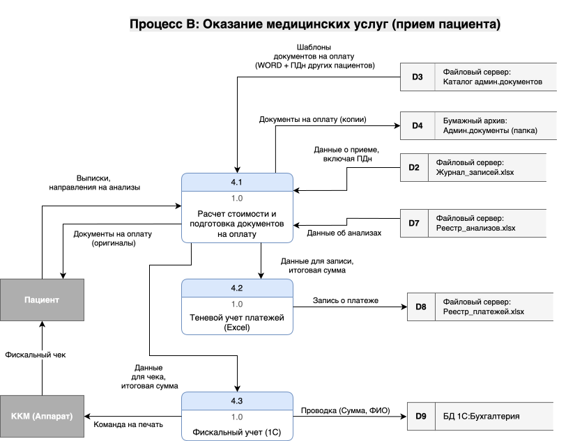
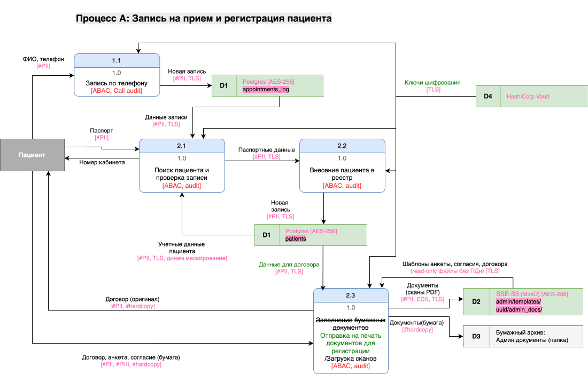
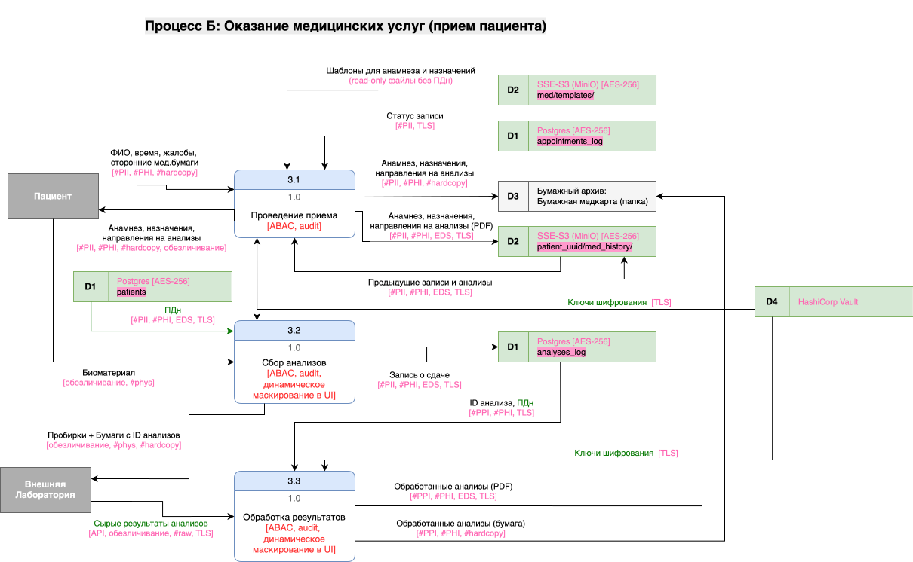
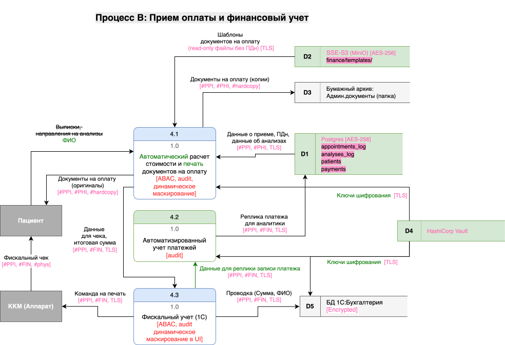

## Задание 1. Анализ безопасности системы
>Чтобы заниматься реализацией новых продуктов, которые основаны на данных, необходимо системно решить проблему хранения конфиденциальных данных и управления ими. Сейчас данные лежат в непосредственной близости к пользователям, поэтому существует риск утечки данных и неправомерного использования информации.
>
>Чтобы защитить данные, используйте механизмы, инструменты и принципы работы с конфиденциальными данными, например, подходы Privacy By Design, Data Minimization и Data Lineage.
>
>В рамках этого задания вам нужно проанализировать состояние As-Is, чтобы впоследствии приступить к его доработке.

### 1. Выявление конфиденциальных данных, не учтенных во внутренних системах
>* Проанализируйте информацию о компании.
>* Создайте диаграммы потоков данных (Data Flow Diagrams). Для каждого процесса создайте отдельную диаграмму.
>* Отобразите на них, как данные перемещаются по системам компании и какие операции над ними совершают.

В компании «Медикаменте» данные делятся на «системные» (внутри 1С) и «теневые» (неучтенные системно). К **неучтенным** относятся те, что хранятся без структурированного доступа, аудита и автоматизированного управления.

### 1.1 Неучтенные конфиденциальные данные
- **Персональные данные (PII)**: ФИО, телефон, email, адрес прописки, место работы/учебы пациента.
- **Расширенные анкеты пациентов:** данные об адресе, месте работы и хронических заболеваниях, заполняемые вручную.
- **Сведения о здоровье (PHI):** медицинские карты, результаты анализов и диагнозы в форматах Excel, JPG, PDF.
- **Финансовые «теневые» данные:** журналы платежей в Excel, которые дублируют записи в 1С для оперативного учета кассирами.
- **Коммуникационные данные:** переписка в Outlook/Exchange, содержащая ПДн пациентов или внутренние распоряжения с данными сотрудников.
- **Физические копии:** распечатки анализов, бумажные журналы на ресепшене и договоры до момента их сканирования.

---

### 1.2. Схемы потоков данных (DFD) — Текущее состояние (As-Is)
Ниже представлены схемы процессов, которые затрагивают неучтенные конфиденциальные данные.

#### Процесс А: Запись на прием и регистрация пациента
Этот процесс порождает первичный поток ПДн.

#### Процесс Б: Оказание медицинских услуг (Прием)
Здесь формируются наиболее чувствительные данные (медицинская тайна).

#### Процесс В: Прием оплаты и финансовый учет
Процесс с избыточным использованием персональных данных и дублированием финансовых данных.

---

### 2. Проведение аудита мер по обеспечению безопасности данных
>* Сопоставьте процессы в компании с требованиями по обеспечению безопасности данных и архитектурными практиками в области безопасности конфиденциальных данных.
>* Составьте список проблемных зон и сохраните его в отдельный документ.

---

### 2.1 Анализ по принципам Privacy by Design

| Принцип PbD                                                                  | Статус | Анализ текущего состояния (As-Is)                                                                                                                                                                                                                                          |
|------------------------------------------------------------------------------| --- |----------------------------------------------------------------------------------------------------------------------------------------------------------------------------------------------------------------------------------------------------------------------------|
| **1. Proactive not Reactive** (Превентивность)                               | **Провален** | Меры безопасности сейчас отсутствуют, cистема не предотвращает утечки.                                                                                                                                                                                                     |
| **2. Privacy as the Default** (Приватность по умолчанию)                     | **Провален** | По умолчанию данные открыты для всех сотрудников с доменной учеткой. Нет автоматического удаления данных или ограничения по сроку хранения.                                                                                                                                |
| **3. Privacy Embedded into Design** (Встроенная приватность)                 | **Провален** | Архитектура строилась из разрозненных продуктов (1С, Excel) без единого контура защиты; приватность не является частью системного дизайна.                                                                                                                                 |
| **4. Full Functionality ― Positive-Sum, not Zero-Sum** (Полная функциональность без компромиссов) | **Провален** | Безопасность принесена в жертву удобству: общее хранилище файлов, редактируемых шаблонов, возможная пересылка конфиденциальных документов через почту.                                                                                                                     |
| **5. End-to-End Security** (Комплексная безопасность)                              | **Провален** | Не обеспечивается:  - безопасное хранение (документы Excel, сканы, JPG не зашифрованы);  - безопасная передача (копирование документов без протоколов шифрования); - отсутствуют процедуры утилизация данных, на общем диске, в почте, на рабочих компьютерах. |
| **6. Visibility and Transparency** (Наглядность и прозрачность)                              | **Провален** | - безопасность в системе непозрачна для пользователей; - протоколы проверок политик безопасности отсутствуют; - нет аудита доступа к конфиденциальной информации                                                                                                   |
| **7. Respect for User Privacy** (Уважение к конфиденциальности пользователей)                        | **Провален** | У пациента нет личного кабинета для управления своими данными. Нет механизмов реализации «права на забвение» в ручном хаосе файлов.                                                                                                                                        |

---

### 2.2 Список проблемных зон (Audit Report)

1. **Отсутствие разграничения прав доступа (RBAC/ABAC):**
   - кроме доменной аутентификации, ограничений нет. Регистратор может видеть диагнозы, а системный администратор — все платежи в Excel.
   - **обоснование:** Это нарушает принцип минимальных привилегий. Любая скомпрометированная учетка сотрудника дает доступ ко всей базе данных компании.
2. **Избыточность собираемых данных**:
   - расширенная анкета содержит поля, которые не являются для регистрации пациента: адрес прописки, места работы или учёбы, хронические заболевания.
   - **обоснование:** это нарушает принцип Data Minimization, кроме того, данные обрабатываются администратором вручную, а не автоматизированно. Что повышает риск их утечки.
3. **Неструктурированное и незащищенное хранение (Shadow IT):**
   - хранение PII, PHI в файлах Excel, Word, JPG и PDF на общем диске.
   - **обоснование:** файловые системы не обеспечивают должного уровня шифрования и контроля доступа на уровне отдельных записей (строк в таблице).
4. **Отсутствие системы аудита и мониторинга:**
   - чтение и изменение файлов происходит без регистрации событий (кто, когда, какое поле изменил).
   - **обоснование:** в случае утечки компания не сможет провести расследование и выявить виновного, что ведет к юридическим рискам.
5. **Дублирование и избыточность данных (Data Redundancy):**
   - кассиры ведут двойной учет в Excel и 1С.
   - **обоснование:** чем больше копий данных, тем выше поверхность атаки; принцип **Data Minimization** требует хранить только одну защищенную копию.
6. **Риски передачи данных через незащищенные каналы:**
   - наличие Outlook/Exchange и ручная обработка сканов подразумевает пересылку чувствительных файлов по почте.
   - **обоснование:** почтовые вложения часто становятся источником утечек, если они не зашифрованы и не имеют меток конфиденциальности.
7. **Отсутствие жизненного цикла данных (Data Lifecycle):**
   - в системе нет механизмов автоматического удаления данных по истечении срока давности или по запросу клиента.
   - **обоснование:** накопление данных «навсегда» противоречит требованиям законодательства о персональных данных.

---

### **Итог аудита**

Текущая архитектура классифицируется как **высокорискованная**. Она не готова к кратному росту данных и штата сотрудников, так как любой новый нанятый сотрудник увеличивает вероятность случайной или преднамеренной утечки из-за отсутствия системных барьеров.

### 3. План улучшений и целевая архитектура
>* Составьте список данных для защиты и проставьте для каждого способы защиты — шифрование, обфускация, обезличивание.
>* Разрабойте механизм тегирования данных с использованием инструментов тегирования.
>* Составьте список инструментов, способов и мер, которые позволят обеспечить конфиденциальность данных в указанных потоках.
>* Доработайте диаграммы из предыдущего шага: отобразите на них, что следует использовать на каждом этапе потока.

---

### 3.1. Классификация и методы защиты данных
Для системного решения проблемы мы разделим все данные на категории и определим для каждой свой метод защиты.

| Категория данных | Элементы данных                   | Метод защиты                                                                                                                                                                        | Обоснование |
| --- |-----------------------------------|-------------------------------------------------------------------------------------------------------------------------------------------------------------------------------------| --- |
| **Персональные (PII)** | ФИО, телефон, email, адрес и т.п. | - **тегирование**; - **шифрование** (AES-256) в покое; - динамическое **маскирование** в интерфейсах - разные виды **обсфукации** для локальной разработки и аналитиков | Требование законодательства РФ по защите ПДн. |
| **Медицинские (PHI)** | Выписки, направления на анализы   | - **тегирование**; - **шифрование** (AES-256) в покое; - **перемешивание, скремблирование** для аналитики;                                                                  | Самые чувствительные данные; утечка несет максимальные риски. |
| **Финансовые** | Платежи, зарплаты сотрудников     | - **тегирование**; - **шифрование** (AES-256) в покое; - **токенизация**;                                                                                                             | Предотвращение финансового мошенничества и соблюдение приватности сотрудников. |
| **Системные** | Логи аудита, метаданные           | - **статическое маскирование**, **хеширование** и контроль целостности                                                                                                              | Необходимо для аудита и выявления нетипичных действий. |

---

### 3.2 Механизм тегирования (Data Tagging)
- Тегирование — процесс разметки метаданными данных в самих базах данных и хранилищах данных, либо во внешних каталогах метаданных.
- Теги, которыми следует конфиденциальные данные в разных процессах управления:
  - **Классификация данных** для управления доступом на уровне атрибутов (ABAC):
    - `PII_Public`: базовая инфа (ФИО); первичный поиск пациента и его записей на ресепшене;
    - `PII_Sensitive`: email, паспорт, телефон, адрес; доступ ресепшену и бухгалтерии только при необходимости.
    - `PHI`: медицинская информация (диагнозы, результаты анализов); доступ только лечащему врачу.
    - `FIN`: финасовые данные, доступные только кассирам и бухгалтерам;
    - `ANONYMIZED`: для данных, прошедших черех обсфукацию и передаваемых в тестовые среды или BI/ML системы; лишены признаков, позволяющих идентифицировать личность.
  - **Data Lineage** для прослеживаемости данных:
    - `raw` - какие-то сырые данные, шаблоны выписок с персональными данными, необработанные результаты анализов, исследований; должны быть удалены в коротком промежутке времени;
    - `verified` - обработанные данные, не должны быть удалены;
    - `archived` - архивные данные, нужно хранить, но в отдельном защищенном хранилище;
    - `old` - старые данные, которые уже не требуется хранить по требованиям законодательства, могут быть удалены;
    - `request_to_delete` - данные, которые хочет удалить пациент;
    - `hardcopy` - бумажные копии;

### 3.3 Список инструментов и мер повышения конфиденциальности
- **Управление доступом**: Внедрение **Keycloak** для реализации RBAC/ABAC и реализации принципи минимизации привелегий, MFA для авторизации;
- **Защита API**: использование **API Gateway** для фильтрации запросов от внешних лабораторий и скрытия конфиденциальных полей.
- **Шифрование**: **HashiCorp Vault** для управления ключами шифрования.
- **Аудит**: стек **ELK (Elasticsearch, Logstash, Kibana)** для сбора логов доступа и настройки алертинга на подозрительную активность.
- **Минимизация данных**: внедрение процесса автоматического удаления сканов и временных файлов Excel после их миграции в основную БД.
- **Инструменты для управления данными**: 
  - **Data Discovery & Classification** (BigId): машина для автоматизированного поиска конф.данных в БД;
  - **Data Catalog & Governance** (Apache Atlas): внешний каталог разметки данных + встроенные возможности БД для хранения метаданных о тегах.
  - **Privacy Operations** (OneTrust): обеспечение права на забвение;

---

### 3.4. Обновленные схемы DFD с мерами повышения конфиденциальности

---
