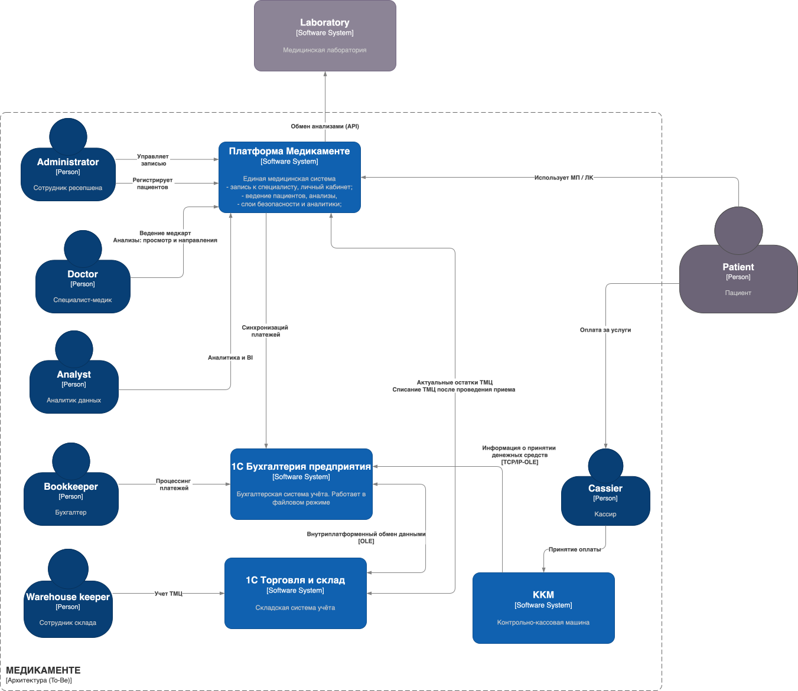
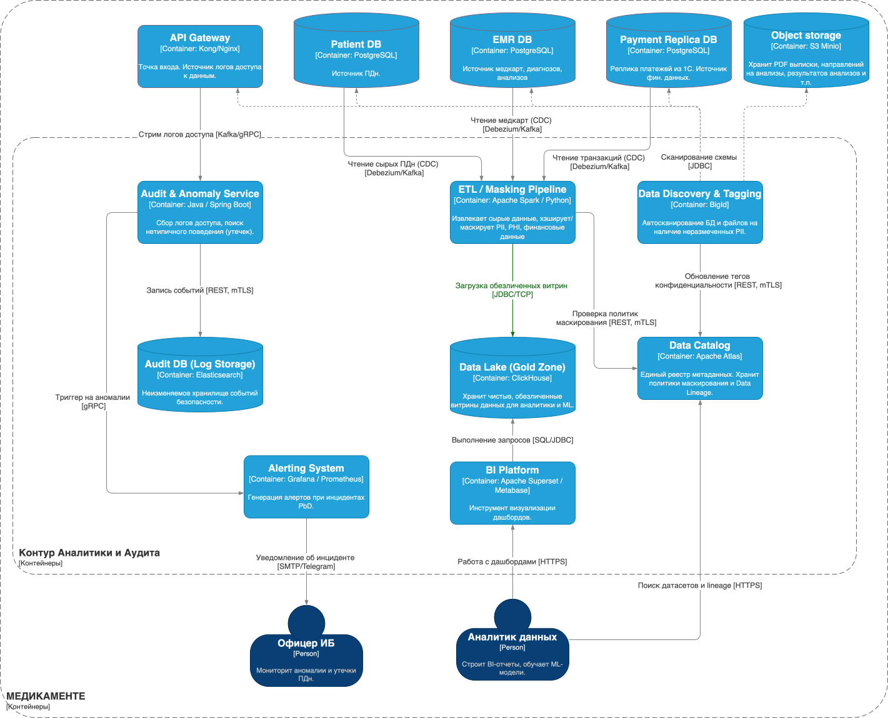

## Задание 2. Проектирование решения
>Используя подход Privacy by Design, проведите анализ и предложите механизмы для предупреждения возможных рисков, связанных с конфиденциальностью. Ваша задача — спроектировать механизмы управления такими рисками до момента реализации изменений в проектируемой системе.
>
>В рамках этого задания вам нужно проанализировать состояние As-Is и оценить, как спроектировать решение с учётом требований To-Be.
>
> #### **Что нужно сделать**
>
> 1. Предложить новые блоки в архитектуру проектируемой системы С4, которые обеспечат соблюдение принципов Privacy By Design во многих блоках реализуемой системы.
> 2. Предложить в целевой архитектуре слой, который обеспечивает аналитическую работу с данными системы с учётом принципов Privacy by Design.

------

### ADR 01. Переход к микросервисной платформе «Медикаменте» с реализацией концепции PdB и изолированным контуром аналитики

#### Контекст
- Текущая архитектура (As-Is) основана на ручном учете в Excel и разрозненных системах 1С, что делает невозможным кратное масштабирование бизнеса при открытии новых филиалов. 
- Кроме того, существующий подход не обеспечивает должной защиты PII, PHI и финансовых данных. 
- Новая архитектура должна быть масштабируемой, способной защитить данные клиентов от утечек и автоматизировать обмен с лабораториями и 1С.
- Также должен быть заложен слой для возможности работы аналитиков с данными с учетом принципов Privacy by Design.

#### Решение
1. **Микросервисная архитектура (DDD).** Разделение монолитной логики на независимые домены со своими БД (PostgreSQL): 
   - `Schedule Service` (запись)
   - `Patient Identity Service` (управление ПДн);
   - `EMR Service` (медкарты, выписки, направления).
   - `Lab Service` (анализы, очистки данных от PII (DLP) при отправке во внешние системы).
   - `Payment Service` (реплика платежей 1С для представления клиентам в личном кабинете и в качестве источника для аналитики).
2. **Изоляция данных (Data Isolation).** Жесткое выделение `Patient Identity Service` как единственного владельца ПДн (ФИО, контакты). Остальные сервисы оперируют только обезличенным `patient_uuid`. Для сборки PDF-бланков сервисы ходят в PIS строго синхронно (по gRPC) без кэширования чувствительных данных.
3. **Шифрование (Application-level Encryption).** Интеграция HashiCorp Vault. `Patient Service` и `EMR Service` запрашивают ключи (DEK) и шифруют PII и диагнозы до записи в PostgreSQL.
4. **Интеграционные адаптеры (Anti-Corruption Layer).** `ERP Adapter` (Apache Camel)  для трансляции протоколов (REST ↔ SOAP для 1С).
5. **Оркестрация Privacy.** Создание `Privacy & Consent Service` для выполнения запросов субъектов (DSR) — рассылка команд на отзыв согласий и удаление данных.
6. **Контур Data Governance и Аудита.** Сбор данных в Data Lake (ClickHouse) через Change Data Capture (Debezium/Kafka) и ETL-маскирование (Spark) для отсечения PII.
   - Внедрение `Data Catalog` и `Data Discovery` для автоматического тегирования конфиденциальных полей в БД и S3.
   - `Audit Service` на Java (Elasticsearch) для мониторинга событий безопасности и аномалий доступа.

#### Последствия (обоснование)
- **Плюсы:**
  - *Высочайший уровень безопасности (PbD):* В случае компрометации отдельной базы (например, расписания) злоумышленник получит только набор обезличенных UUID. Отзыв ключа в Vault мгновенно уничтожает данные («право на забвение»).
  - *Масштабируемость:* Независимые сервисы (например, Schedule) можно масштабировать отдельно под нагрузку мобильного приложения.
  - *Безопасная аналитика:* BI-специалисты работают с "чистыми" витринами в Data Lake, не имея физического доступа к PII, PHI и другим конф.данным.
- **Минусы:**
  - *Высокая сложность разработки и эксплуатации:* Требуются сильные компетенции в DevOps (Kafka, Vault, Istio для mTLS).
  - *Сетевые накладные расходы:* Повышение latency из-за внутренних вызовов (gRPC) для агрегации данных.
  - *Сложность транзакций:* Потребуется реализация распределенных транзакций (например, Saga) при отмене записи и возврате платежа.

#### Возможные альтернативы
1. **Использование MongoDB для EMR Service:** Документоориентированная БД отлично подходит для медкарт с гибкой схемой (JSON). Отклонено в пользу PostgreSQL с типом `JSONB`, чтобы избежать "зоопарка" технологий и упростить интеграцию с Vault для частичного шифрования полей.
2. **BFF (Backend-for-Frontend) для агрегации ПДн:** Склейка ФИО из `Patient Service` и диагнозов из `EMR Service` на стороне Gateway или отдельного BFF-сервиса вместо межсервисного gRPC. Отклонено (или отложено), так как для генерации серверных PDF-выписок бэкендам всё равно требуется прямой доступ к профилю пациента.

### Диаграммы C4
- [c4_context_to-be.drawio.xml](c4_context_to-be.drawio.xml)
- [c4_container_ops_to_be_v2.drawio.xml](c4_container_ops_to_be_v2.drawio.xml)
- [c4_container_analytics_tobe.drawio.xml](c4_container_analytics_tobe.drawio.xml)

- 
- 
- 
