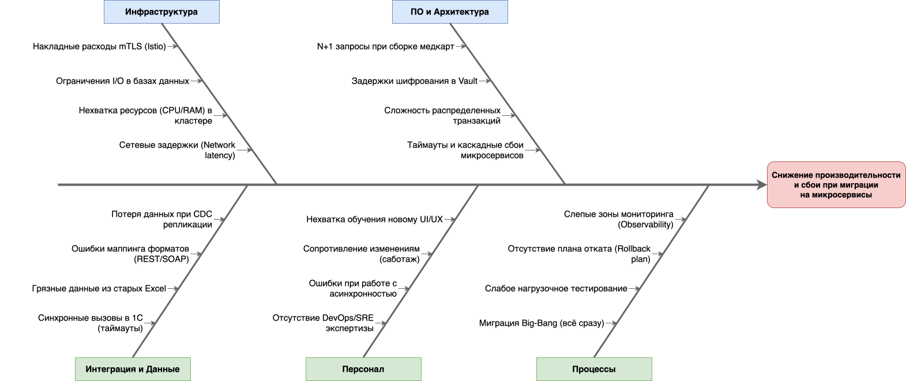

## Задание 4. Оценка узких мест при миграции

>В компании планируется миграция устаревшей монолитной системы на современную архитектуру (например, на микросервисную). В процессе перехода необходимо выявить потенциально узкие места, которые могут негативно повлиять на работоспособность нового решения.
>
>### Что нужно сделать
>1. **Проанализировать ситуацию.**
>    * Изучить описание текущей системы и целей миграции.
>    * Определить ключевые процессы и компоненты, затрагиваемые миграцией (например, базы данных, коммуникационные каналы, серверное оборудование, бизнес-логика).
>2. **Построить диаграмму Исикавы.**
>    * Построить диаграмму «Рыбья кость» (Ishikawa) для выявления потенциальных причин узких мест.
>3. **Выделить основные категории и для каждой указать возможные проблемы.**
>    * Например, «Инфраструктура», «Программное обеспечение», «Интеграция», «Персонал», «Процессы».
>3. **Предложить рекомендации.**
>    * Составить краткий список мер по устранению выявленных узких мест на основе диаграммы.
>    * Оценить приоритетность этих мер.
>4. **Сформировать отчёт.**
>    * Представить диаграмму Исикавы (draw.io).
>    * Описать выявленные проблемы и предложенные решения в виде отчёта.
>    * Ревьюер будет смотреть на системность и глубину проработки возможных рисков снижения производительности системы.

### 1. Диаграмма Исикавы
[task4_ishikawa.drawio.xml](task4_ishikawa.drawio.xml)
- 
---
### 2. Отчёт: Анализ узких мест при миграции на микросервисную архитектуру

**Контекст миграции:**
Переход компании «Медикаменте» от ручного учёта (Excel) и монолитных систем (1С) к распределённой микросервисной платформе с внедрением строгих политик безопасности (Privacy by Design, HashiCorp Vault, mTLS). Ожидается пятикратный рост нагрузки за счёт открытия новых филиалов.

#### Выявленные узкие места (Категории из диаграммы Исикавы)

**Категория 1: Инфраструктура**
- **Накладные расходы mTLS (Istio):** Повсеместное шифрование внутреннего трафика создаст дополнительную нагрузку на CPU для sidecar-прокси (Envoy).
- **Ограничения I/O в базах данных:** Разделение на независимые БД увеличивает количество транзакций и операций чтения/записи на уровне дисковой подсистемы.
- **Нехватка ресурсов (CPU/RAM) в кластере:** JVM-контейнеры (Spring Boot) потребляют значительно больше памяти, чем ожидается при первичном сайзинге, что может привести к OOM (Out of Memory) сбоям.
- **Сетевые задержки (Network latency):** В монолите вызов функции происходит в оперативной памяти (нс). В микросервисной схеме вохможны прыжки с суммарным временем в десятки мс.

**Категория 2: ПО и Архитектура**
- **N+1 запросы при сборке медкарт:** Изоляция PII заставляет микросервисы (EMR, Schedule) делать множество синхронных gRPC-вызовов в Patient Identity Service для получения ФИО.
- **Задержки шифрования в Vault:** Необходимость запрашивать DEK-ключи для каждой записи диагноза создаёт узкое место в пропускной способности Vault.
- **Сложность распределённых транзакций:** При сбое на одном из этапов (например, 1С недоступна) потребуется механизм компенсации (Saga Pattern) для отката чеков и расписания.
- **Таймауты и каскадные сбои микросервисов:** Если один сервис зависнет, ожидающие его сервисы быстро исчерпают пулы потоков (Thread Pools) и тоже упадут.

**Категория 3: Интеграция и Данные**
- **Синхронные вызовы в 1С (таймауты):** Legacy-система 1С работает медленнее современных микросервисов. Синхронное ожидание ответа положит новые сервисы при пиковой нагрузке.
- **Грязные данные из старых Excel:** Отсутствие валидации в Excel означает наличие опечаток, неверных форматов дат и дубликатов. Прямой импорт в строгую реляционную модель Postgres выдаст ошибки.
- **Ошибки маппинга форматов (REST/SOAP):** Сложности в трансформации современных JSON-контрактов в XML для 1С на уровне Apache Camel (ERP Adapter).
- **Потеря данных при CDC репликации:** Если коннекторы Debezium упадут или Kafka переполнится, аналитическое Озеро данных (Data Lake) рассинхронизируется с операционными базами.

**Категория 4: Персонал**
- **Отсутствие DevOps/SRE экспертизы:** Команда не умеет эксплуатировать Kubernetes, Service Mesh и Kafka в production-среде.
- **Ошибки при работе с асинхронностью:** Разработчики привыкли к императивному и синхронному коду; возможны race conditions и потеря сообщений.
- **Сопротивление изменениям (саботаж):** Врачи и администраторы привыкли к старым Excel-журналам. Нежелание переучиваться приведёт к искусственному замедлению работы клиники.
- **Нехватка обучения новому UI/UX:** Медленная работа сотрудников ресепшена в новой программе приведёт к образованию очередей из пациентов в первые недели.

**Категория 5: Процессы**
- **Миграция Big-Bang (всё сразу):** Единовременное переключение всех процессов на новую систему несёт фатальные риски простоя бизнеса.
- **Слабое нагрузочное тестирование:** Тестирование системы без учёта накладных расходов Vault, mTLS и реального объёма исторических данных.
- **Отсутствие плана отката (Rollback plan):** Непонимание того, как вернуть клинику к работе в Excel/1С, если в новой микросервисной платформе обнаружится критический блокер в первый день.
- **Слепые зоны мониторинга (Observability):** Без распределённой трассировки (Distributed Tracing) невозможно понять, в каком именно из 10 контейнеров завис запрос пользователя.

---
### 3. Рекомендации по устранению (Сортировка по приоритету)

| Приоритет | Категория | Рекомендация (План действий)                                                                                                                                                                                                       |
| --- | --- |------------------------------------------------------------------------------------------------------------------------------------------------------------------------------------------------------------------------------------|
| **P1 (Критично)** | **Процессы** | **Отказ от Big-Bang в пользу Strangler Fig.** Внедрять новую платформу поэтапно (например, сначала только запись на приём, затем медкарты). Обязательно разработать и протестировать **Rollback-план** для каждого этапа.          |
| **P1 (Критично)** | **Интеграция** | **Переход на асинхронную интеграцию с 1С.** Использовать очереди между микросервисами для сглаживания пиковых нагрузок и предотвращения таймаутов.                                                                                 |
| **P1 (Критично)** | **Персонал** | **Управление изменениями (Change Management).** За месяц до релиза провести обязательные тренинги для врачей и ресепшена на тестовом стенде. Выделить лучших врачей, которые помогут коллегам адаптироваться.                 |
| **P2 (Высокий)** | **ПО и Архитектура** | **Внедрение паттерна Circuit Breaker и Distributed Tracing.** Интегрировать Resilience4j для защиты от каскадных сбоев и OpenTelemetry (Jaeger) для сквозного мониторинга запросов через все микросервисы.                         |
| **P2 (Высокий)** | **Данные** | **Пре-миграционная очистка данных (Data Cleansing).** Разработать ETL-скрипты, которые заранее выгружают данные из Excel в Staging, нормализуют их и логируют невалидные строки для ручного разбора до дня миграции. |
| **P2 (Высокий)** | **ПО и Архитектура** | **Кэширование ключей Vault (Transit Engine).** Использовать батчинг или локальное кэширование ключей шифрования в оперативной памяти сервисов, чтобы снизить I/O нагрузку на HashiCorp Vault.                                      |
| **P3 (Средний)** | **Персонал** | Запланировать найм или привлечение на аутсорс DevOps/SRE специалистов для настройки CI/CD, Kubernetes и алертинга до начала опытно-промышленной эксплуатации.                                                                      |
| **P3 (Средний)** | **Инфраструктура** | Провести профилирование (Load Testing) с полной симуляцией production-среды (mTLS включен, тестовая БД заполнена) для выявления реальных лимитов CPU/RAM и настройки Horizontal Pod Autoscaler (HPA).                       |о SRE-инженера до начала активной фазы разработки и организовать воркшопы для команды по паттернам проектирования микросервисов (Saga, Outbox pattern). |