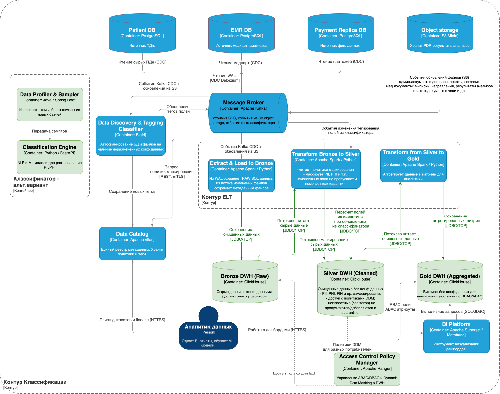

## **Задание 6. Классификация данных**
>Ваша задача — добавить движок для классификации данных перед их загрузкой в хранилище. Для этого предложите в целевой архитектуре слой, который обеспечивает аналитическую работу с данными системы с учётом принципов Privacy by Design.
>
>### **Что нужно сделать**
>1. Спроектируйте движок для классификации данных перед их пакетной загрузкой в аналитическое хранилище данных. При проектировании не забудьте учесть, что структуры данных на входе в хранилище подвержены структурным изменениям и не размечены на предмет того, к какому классу конфиденциальности относятся.
>2. В хранилище данных тем не менее будут частично храниться данные, которые можно отнести к конфиденциальным. Поэтому необходимо предложить проектное решение по организации специального слоя/нескольких слоёв в хранилище данных, учитывающее эту особенность. Обратите внимание, кроме слоёв можно предложить и другие меры.
>3. Ответить на вопросы, какие метрики вы будете использовать для оценки эффективности классификации данных и как это поможет в процессе оптимизации системы.
>4. Подумать о том, как будет обеспечена scalability системы и как вы планируете расширить систему при увеличивании объёма данных или количества пользователей.
>
>Загрузите диаграмму C2 решения — движка, реализующего задачу классификации данных перед загрузкой их в хранилище в директорию **Task6** в рамках пул-реквеста.

---

## ADR: Реализация архитектуры классификации данных для аналитики на базе паттерна Medallion

### Контекст
- Система должна обрабатывать разнородные данные: структурированные (из PostgreSQL через CDC) и неструктурированные (PDF-договора, выписки из S3 Minio). 
- Данные содержат чувствительную информацию (PII/PHI/FIN). 
- Основная проблема — **непредсказуемость структуры** и риск появления новых конфиденциальных полей в сырых данных. 
- Традиционный статический подход к маскированию не подходит, так как данные могут меняться «на лету», а ручная разметка создаст бутылочное горлышко.

### Решение 
Внедрить трехуровневую архитектуру данных (Bronze-Silver-Gold) на базе ClickHouse с внешним контуром классификации (BigID/Apache Atlas) и динамическим управлением доступом (Apache Ranger).

1. **Слой Bronze (Raw):** Данные сохраняются «как есть». Доступ ограничен только техническими учетными записями (насосами).
2. **Контур классификации (Discovery):** Сканер (BigID) асинхронно анализирует Bronze. При обнаружении новых полей или документов он проставляет теги в Apache Atlas и отправляет событие в Kafka.
3. **Слой Silver (Cleaned/Masked):** Процесс трансформации (Spark/Python) «слушает» события от классификатора.
   * Данные без тегов или с подозрением на PII отправляются в **Quarantine**.
   * Данные с подтвержденными тегами маскируются согласно политикам из Ranger/Atlas.
4. **Слой Gold (Business):** Агрегированные витрины для BI (Superset), доступ к которым регулируется строго через RBAC/ABAC в Apache Ranger.

### Последствия (обоснование)
* **Плюсы:**
  * **Privacy by Design:** Система автоматически блокирует попадание неразмеченных персональных данных в слои Silver и Gold.
  * **Гибкость схем:** Поддержка неструктурированных данных из S3. При изменении формата документа BigID пересканирует его и обновит политики без переписывания ETL-кода.
  * **Динамическое маскирование (DDM):** Позволяет хранить одну версию данных в Silver, скрывая детали от аналитиков и показывая их офицерам безопасности «на лету» через политики Ranger.
  * **Аудируемость:** Полный Lineage через Apache Atlas позволяет отследить путь каждого PII-поля от источника до витрины.
* **Минусы:**
  * **Сложность «петли обратной связи»:** Необходимость реализации механизма переповторов (retry) для данных, вышедших из карантина после классификации.
  * **Latency:** Появление данных в Silver может задерживаться на время, необходимое для работы сканера BigID.
  * **Инфраструктурные затраты:** Требуется поддержка стека Ranger/Atlas/BigID, что усложняет эксплуатацию.

### Возможные альтернативы
1. **Статическое маскирование на этапе Extract:** Маскирование данных прямо при вычитке из источников.
   * *Почему отклонено:* Невозможно применить к неструктурированным файлам в S3 и требует постоянного обновления кода при изменении схем в исходных БД.
2. **Использование SaaS-решений (Snowflake/Databricks):** Встроенные средства управления PII.
   * *Почему отклонено:* Требования к локализации данных в РФ/Сербии и наличие собственной On-premise инфраструктуры на базе ClickHouse.
3. **Ручная разметка (Data Steward):** 
   * *Почему отклонено:* Не масштабируется при больших объемах и высокой вариативности медицинских документов.

### Схема контейнеров С4
[c4_container_classification_pre_analitics_to-be.drawio.xml](c4_container_classification_pre_analitics_to-be.drawio.xml)
- 
